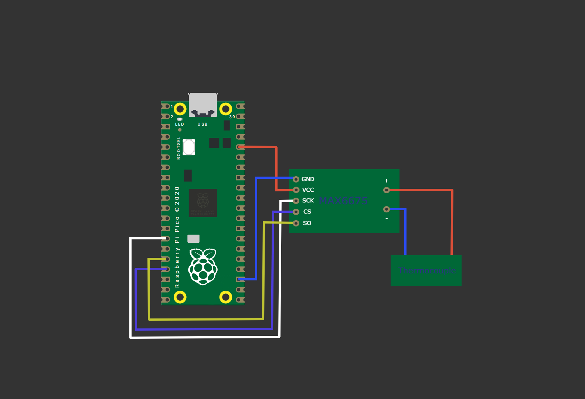
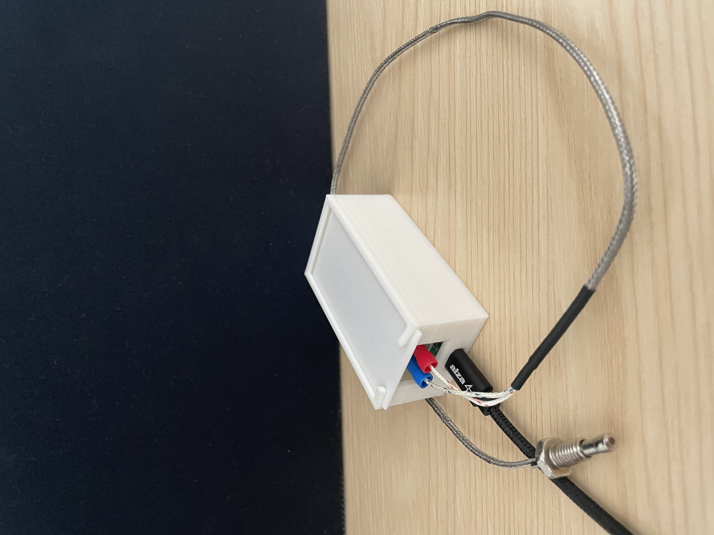
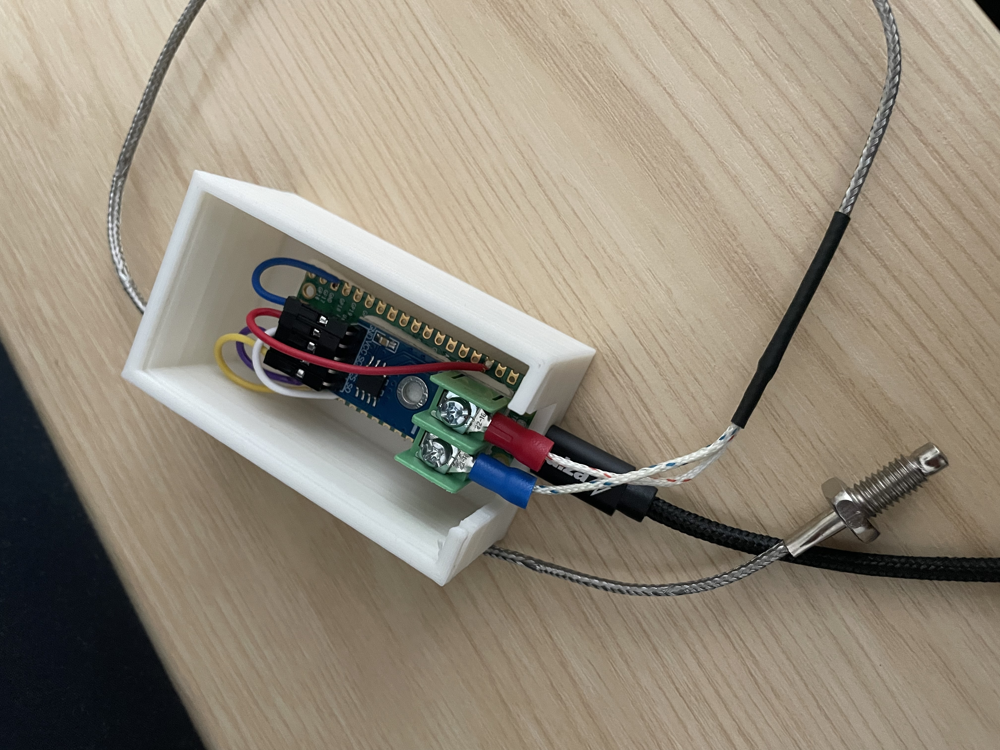
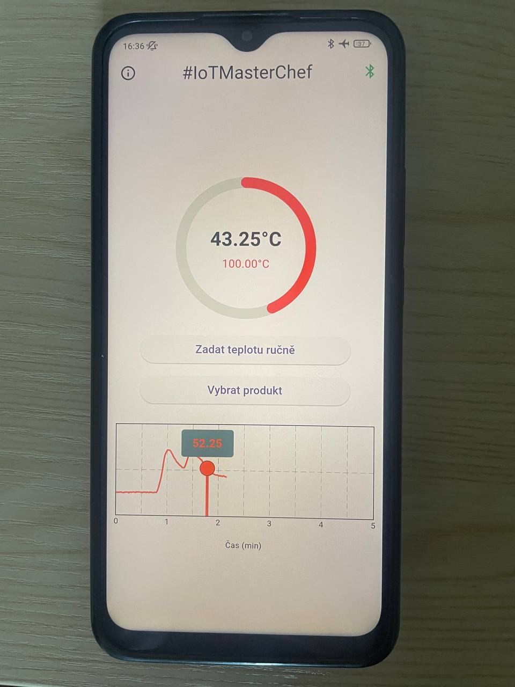

# Wireless Grill Thermometer – #IoTMasterChef

## 📋 Project Overview

This project implements a **wireless grill thermometer** using a Raspberry Pi Pico W and a MAX6675 thermocouple sensor. The device reads temperature data and sends it every second via Bluetooth Low Energy (BLE) to a mobile app built in Flutter. The app displays the temperature in real-time and alerts the user when the target value is reached.

---

## 🔧 Components Used

| Component             | Description                               |
| --------------------- | ----------------------------------------- |
| Raspberry Pi Pico 2 W | Microcontroller with built-in BLE         |
| MAX6675 Module        | Thermocouple-to-digital converter (SPI)   |
| Thermocouple          | 0°C to 1200°C range                    |
| Power Supply          | USB-powered (no battery in final version) |
| Mobile App Framework  | Flutter (Dart) for Android                |
| Firmware Language     | MicroPython                               |

---

## 🔌 Hardware Connection

Wiring diagram:

Photo of the real setup:

---

## 💻 Firmware (MicroPython)

The firmware performs the following tasks:

* Initializes SPI communication with the MAX6675 sensor
* Reads temperature in °C (formatted as 0.00)
* Sets up a BLE service and characteristic
* Sends temperature every second to connected devices using Notify

> BLE Name: `PicoGrill`

---

## 📱 Mobile App (Flutter)

The Flutter app:

* Scans for BLE devices and connects to `PicoGrill`
* Displays the current temperature on a real-time graph
* Allows the user to set a target temperature
* Sends audio and system notification when the target is reached

Photos of the app running on a real device:

---

## 🚀 How to Use

### 1. Flash the Firmware

Simply connect the Pico W to your computer via USB and open it in the Thonny editor. Save the code file as `main.py` directly to the Pico board. The program will start running automatically.

### 2. Run the App

1. Open the `mobile_app` folder in Android Studio.
2. Connect your phone and run the app.

---

## 🛠️ Future Improvements

* Add battery and power management (Li-Pol with charging module)
* Implement app for iOS
* Add dual-channel temperature measurement

---

## 📃 License

MIT License

---

## 🎓 Academic Note

This project was completed as part of the course *Komunikační systémy pro IoT* by the following students:

* Nikita Krasilnikov
* Ivan Efimov
* Rauf Iusupov
* Ivan Pavlov
